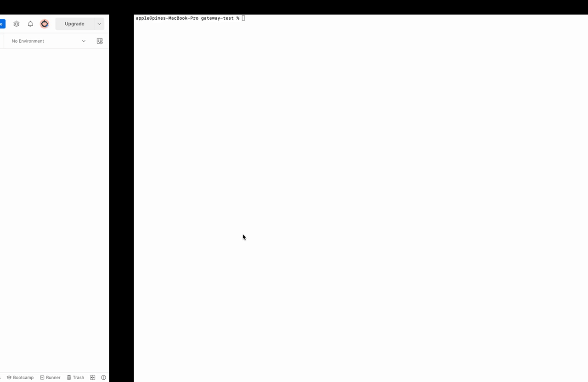

# Grpc Playground

This playground  contains the source to play with Grpc Transcoding, Grpc Reflection, Grpc debugging using Postman and Grpc proxying.

## What can I find here?

* [Client server Grpc Call](https://learn.microsoft.com/en-us/aspnet/core/grpc/?view=aspnetcore-6.0) (Dotnet client, Kestrel, Unary, Stream, ...)

* [Enabling Grpc Transcoding in Dotnet 7](https://devblogs.microsoft.com/dotnet/announcing-grpc-json-transcoding-for-dotnet/) (with VS, VS Code, command-line CLI)
  * [Transcode Json to Grpc](https://devblogs.microsoft.com/dotnet/announcing-grpc-json-transcoding-for-dotnet/)
  * [Swagger | SwaggerGen](https://learn.microsoft.com/en-us/aspnet/core/grpc/httpapi?view=aspnetcore-7.0)
  * [Dockerizing Grpc (Upcomming)] (Get Started, Unix Domain Sockets, ...)
* [Enabling Grpc Reflection in Dotnet](https://learn.microsoft.com/en-us/aspnet/core/grpc/test-tools?view=aspnetcore-6.0) (out of the box)
  * [Calling with Postman](https://blog.postman.com/postman-now-supports-grpc/) (Unary call, Stream call, ...)
* [Configuring Envoy To Proxy a Grpc Service](https://www.envoyproxy.io/docs/envoy/latest/configuration/http/http_filters/grpc_json_transcoder_filter)
  * Transcode Json to Grpc
  * Proxy Grpc to Grpc

## How can I run?

* Make sure you have Dotnet7, Docker-Compose, Protoc installed
* Grant exec permission to run.sh
* Start using ```./run.sh```

## Preview


